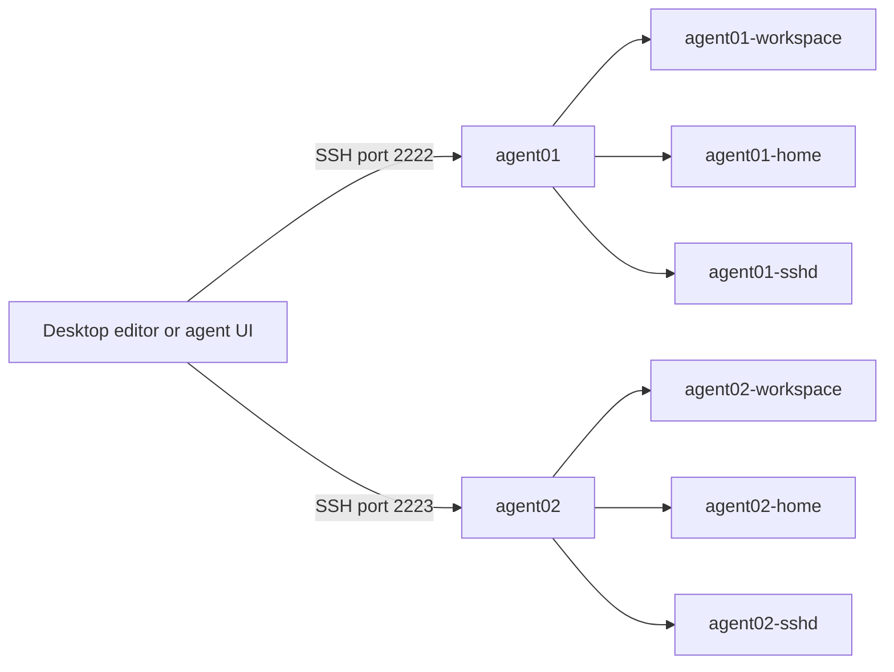

# Sandboxed AI agents

Coding agents want a lot of room: read and write anywhere in the project, run
shell commands, install packages, reach the network. Running several of them
directly on your laptop means they all share one home directory, one set of
credentials, and each other's files.

This repository gives each workspace its own rootless Podman container instead.
You pick which agents go in it, you reach it over SSH from your terminal, VS
Code, or a desktop agent UI, and nothing from your host is mounted unless you
explicitly ask for it.

```bash
./sandbox build
./sandbox agent01 up --agents codex --ssh-config
./sandbox agent01 agents login codex
./sandbox agent01 codex
```

That's a working sandbox with Codex installed, signed in, and running in a
persistent terminal.

## What's inside

The image is Debian 12 slim with Node.js 24 and npm, .NET SDKs 9 and 10, Git,
GitHub CLI, Azure CLI with the DevOps extension, PowerShell, tmux, OpenSSH, and
the system dependencies for headless Playwright runs against Chromium, Firefox, and Edge.
Everything above ships in the shared image; agents and dashboards install per
sandbox, into that sandbox's own home volume.

Six agents are available, and none of them installs by default. You name at
least one when you create a sandbox:

| Agent ID | Command | Installed from |
|---|---|---|
| `copilot` | `copilot` | npm `@github/copilot` |
| `claude` | `claude` | npm `@anthropic-ai/claude-code` |
| `codex` | `codex` | npm `@openai/codex` |
| `hermes` | `hermes` | Nous Research installer and source checkout |
| `opencode` | `opencode` | npm `opencode-ai` |
| `deepseek` | `dsh` | npm `@deepseek-ai/dsh` (DeepSeek Harness) |

Four optional web tools have their own separate selection, so `--agents all`
does not drag them in:

| Tool ID | Port | What it is |
|---|---|---|
| `tokentracker` | `7680` | Token usage dashboard |
| `t3` | `3773` | T3 Code headless server |
| `hermes-dashboard` | `9119` | Hermes web dashboard (needs the `hermes` agent) |
| `deepseek-ui` | `3080` | Harness web UI (needs the `deepseek` agent) |

## Requirements

You need a Linux host with rootless Podman 5 or newer, set up the usual way:
subordinate UID/GID ranges, `newuidmap` and `newgidmap`, `pasta`, and delegated
cgroups v2. Add Bash, Python 3.9+, and the OpenSSH client tools. Run
`podman info` as your normal user first; if that works, the launcher will too.

Never run `./sandbox` with `sudo`. Building the image and installing agents the
first time needs internet access and several GB of disk.

### Windows PowerShell

The Windows toolset targets Windows 11 x64, PowerShell 7, Python 3.9+, and an
already configured rootless WSL2 Podman 6.0+ machine. See the
[Windows quick guide](docs/QUICKGUIDE-WINDOWS.md) for prerequisites, tested versions, build/create,
SSH, lifecycle commands, transactional updates, and offline tests.

```powershell
.\sandbox.ps1 build
.\sandbox.ps1 agent01 up --agents codex --ssh-config
ssh agent01
```

## Getting started

Build the image once, then create a sandbox:

```bash
./sandbox build
./sandbox agent01 up --agents codex --ssh-config
./sandbox agent01 check
./sandbox agent01 agents login codex
./sandbox agent01 codex
```

`login` prints a URL and a one-time code to finish in your desktop browser. The
last command opens a persistent tmux session; detach with Ctrl+B, then D, and
reconnect with the same command later.

Without a workspace directory, your project files live in the `agent01-workspace`
named volume, mounted at `/workspace`. If you would rather bind a folder from
your host, pass it when you create the sandbox:

```bash
./sandbox agent01 up ./workspaces/agent01 --agents codex --ssh-config
```

Those two `up` commands are alternatives, not steps in sequence. See
[workspace storage](docs/SANDBOXES.md#choose-workspace-storage) for the
trade-offs.

`--ssh-config` is what makes `ssh agent01`, VS Code Remote SSH, port forwarding,
and the persistent terminal shortcuts work. It writes a dedicated key and config
under `~/.ssh/sanboxed-agents/agent01/` and adds an Include at the top of
`~/.ssh/config`. Skip it if you only want Podman-based agent management, and
[add SSH later](docs/SANDBOXES.md#ssh-setup) when you need it.

### Open the workspace in VS Code

Install the Remote - SSH extension on your desktop, run **Remote-SSH: Connect to
Host…**, pick `agent01`, and open `/workspace`. VS Code installs its server into
the sandbox's home volume, so it survives restarts. You edit on your desktop
while terminals, Git, the SDKs, and workspace extensions all run in the
container. [SSH and VS Code](docs/SANDBOXES.md#vs-code) covers diagnostics, and
[desktop control](docs/ARCHITECTURE.md#desktop-control) covers UIs that drive
several sandboxes at once.

### Add agents and tools

Selections are editable after creation:

```bash
./sandbox agent01 agents enable claude
./sandbox agent01 agents login claude
./sandbox agent01 tools enable tokentracker
./sandbox agent01 forward tokentracker
```

Leave the forwarding terminal open and open <http://127.0.0.1:7680>.

For a second, independent workspace, create another sandbox with its own name
and SSH port:

```bash
./sandbox agent02 up --ssh-port 2223 --agents claude --ssh-config
```

To build and test containers inside a sandbox, add `--capabilities podman`:

```bash
./sandbox agent01 up --agents codex --capabilities podman --ssh-config
# For an existing sandbox instead:
./sandbox agent01 update --no-build --capabilities podman
```

The capability automatically installs and configures rootless Podman in an
optional image layer. It changes the sandbox's security settings to permit
nesting. See [nested containers](docs/TOOLCHAIN.md#nested-containers-with-podman)
for requirements, build/run commands, storage, and port forwarding.

### Update

```bash
./sandbox agent01 update       # rebuild the image, recreate this sandbox
./sandbox update --all         # rebuild once, update every owned sandbox
```

Storage, agent and tool selections, resource limits, ports, and SSH access all
carry over. Save your work first, because recreating a container kills running
sessions. [Image updates](docs/SANDBOXES.md#upgrade-the-image) covers custom
builds and rollback.

## How it works

Each sandbox is one container plus three named volumes: the workspace, the
agent's home directory, and the SSH server state. Only the workspace can be
swapped for a host bind. Podman owns the containers; your editor or agent UI
owns the sessions inside them.



Agents run as UID 1000 inside Podman's rootless user namespace, mapped back to
your host user with `keep-id` so workspace files stay editable from both sides.
`no-new-privileges` is on unless the Podman capability is selected. The launcher
refuses workspace binds that would expose its own source, Git metadata, or SSH state.

### What this does not protect you from

Every agent in one sandbox shares that sandbox's user, home directory, and
credentials. Disabling an agent takes its command off PATH; it does not revoke
access to files already cached in the home volume. Use separate sandboxes when
you want separation.

Outbound networking is open so installs and model calls work, which also means
an agent can reach the internet and whatever your LAN exposes. Containers share
the host kernel. For code you actively distrust, run the same workflow inside a
dedicated VM.

[SECURITY.md](SECURITY.md) states the threat model in full and explains how to
report a vulnerability.

## Command reference

Commands take the sandbox name first: `./sandbox NAME COMMAND [SUBCOMMAND] [PARAMETERS]`.
Only `build` and `update --all` run without a name, and command names cannot be
used as sandbox names. A sandbox created earlier under a command name, such as
`claude`, can no longer be addressed by the launcher; manage it with Podman.

```text
./sandbox build [podman build args]
./sandbox NAME up [WORKSPACE [SSH_PORT]] --agents LIST [--tools LIST] [--capabilities LIST] [--ssh-config]
./sandbox NAME start|stop|shell|check|check-full|fingerprint
./sandbox NAME agents list|check|set|enable|disable|update|login ...
./sandbox NAME tools list|check|set|enable|disable|update ...
./sandbox NAME tools login github             # GitHub login and Git commit identity
./sandbox NAME tools setup t3                 # T3 Connect sign-in and activation
./sandbox NAME tools setup azdo [--persist|--clear] # PAT and default organization
./sandbox NAME tools setup azure [--interactive] # independent Azure session
./sandbox NAME run AGENT [args...]          # one-off command
./sandbox NAME tool TOOL [args...]          # one-off tool command
./sandbox NAME copilot|claude|codex|hermes|opencode|deepseek|t3   # persistent terminal
./sandbox NAME service TOOL status|start|stop|restart|logs
./sandbox NAME forward TOOL [LOCAL_PORT]
./sandbox NAME ssh-config [--install]
./sandbox NAME update [--no-build] [--capabilities LIST]
./sandbox update --all [--no-build] [--capabilities LIST]
./sandbox NAME remove [--volumes]
```

Run `./sandbox --help` for the full syntax, including environment variables such
as `SANDBOX_IMAGE`, `SANDBOX_CPUS`, and `SANDBOX_MEMORY`.

Azure DevOps PAT setup is described in the
[setup and PAT workflow](docs/TOOLCHAIN.md#set-up-azure-devops).

## Documentation

Start with the [Linux quick guide](docs/QUICKGUIDE-LINUX.md) or the
[Windows quick guide](docs/QUICKGUIDE-WINDOWS.md).

| If you want to | Read |
|---|---|
| Build and create sandboxes from Windows PowerShell | [Windows toolset](docs/QUICKGUIDE-WINDOWS.md) |
| Connect, forward ports, stop, upgrade, or remove a sandbox | [Sandbox lifecycle and SSH](docs/SANDBOXES.md) |
| Pick agents, sign in, pin versions, run dashboards | [Agents and tools](docs/AGENT-SETUP.md) |
| Configure the image, .NET, npm, Playwright, Git, Azure | [Development toolchain](docs/TOOLCHAIN.md) |
| Configure sandbox Azure login on Linux or native Windows | [Azure setup](docs/AZURE-SETUP.md) |
| Understand isolation, desktop UIs, and remote workers | [Architecture](docs/ARCHITECTURE.md) |
| Know why it is built this way before changing it | [Project context](CONTEXT.md) |
| Work on this repository as an AI coding agent | [AGENT.md](AGENT.md) |

Every guide uses the same examples: `agent01` on SSH port `2222` is the first
sandbox, `agent02` on `2223` is the second, and `./workspaces/agent01` appears
whenever an example needs an explicit host bind. Host commands run from this
repository; anything marked "inside the sandbox" runs in its terminal at
`/workspace`. `NAME`, `X.Y.Z`, and uppercase words are placeholders.

## Repository layout

```text
sandbox           Entry point; everything else is an implementation detail
src/host/         Host CLI: dispatch, SSH files, lifecycle, image updates
src/container/    Containerfile plus the in-container agent/tool manager
tests/            Offline regression tests, no Podman or network needed
docs/             The guides linked above
```

Run the offline suite with `make test`, or just the syntax, catalog, and
documentation link checks with `make check`. Both need Bash, Python 3.9+,
Node.js, and OpenSSH client tools.

## Credits

This launcher does very little on its own. It creates a container, wires up SSH,
and gets out of the way. Everything that makes a sandbox worth opening was built
by somebody else, so here they are.

The agents you can install:

- [GitHub Copilot CLI](https://github.com/github/copilot-cli) by GitHub
- [Claude Code](https://github.com/anthropics/claude-code) by Anthropic
- [Codex CLI](https://github.com/openai/codex) by OpenAI
- [Hermes Agent](https://github.com/NousResearch/hermes-agent) by Nous Research
- [OpenCode](https://github.com/sst/opencode) by SST
- [DeepSeek Harness](https://github.com/deepseek-ai/deepseek-harness) by DeepSeek

The optional tools and dashboards:

- [T3 Code](https://github.com/pingdotgg/t3code) by Theo and the T3 team
- [TokenTracker](https://github.com/xiufengsun/TokenTracker) by Xiufeng Sun
- The [Hermes dashboard](https://hermes-agent.nousresearch.com/docs/user-guide/features/web-dashboard)
  and the DeepSeek web UI, which ship with their respective agents

And the foundation the image is built on:

- [Podman](https://podman.io) for rootless containers, which is the entire
  reason this approach works without a daemon or root
- [Debian](https://www.debian.org) for the base image
- [Node.js](https://nodejs.org), [.NET](https://dotnet.microsoft.com),
  [Playwright](https://playwright.dev), [tmux](https://github.com/tmux/tmux),
  [OpenSSH](https://www.openssh.com), [Git](https://git-scm.com), the
  [GitHub CLI](https://github.com/cli/cli), and the
  [Azure CLI](https://github.com/Azure/azure-cli)

Each of these projects has its own license and terms. Installing an agent here
means agreeing to them and to whatever provider it talks to. This repository
only automates the installation; it makes no claim on any of the above, and none
of these projects endorse it.

## License

MIT, see [LICENSE](LICENSE). That covers this launcher and its documentation
only. The agents, tools, and SDKs it installs keep their own licenses, and
nothing here is redistributed.

## Status

The launcher and its offline test suite are exercised regularly. Live runs on
Linux x86-64 with rootless Podman have covered sandbox creation, agent
installation, SSH setup, port forwarding, image updates, and removal.

Still unverified end to end: real provider sign-in and model requests, the VS
Code Agents window, the T3 and Kandev desktop integrations, remote-worker
setups, and ARM64 or otherwise customized image builds.
