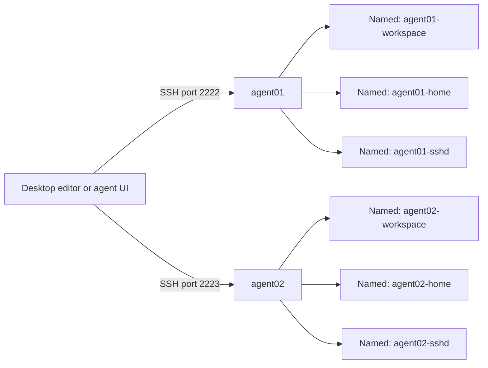

# Architecture and desktop control

[Back to the overview](../README.md) · [Sandbox lifecycle and SSH](SANDBOXES.md)

## One sandbox per workspace

The launcher creates a rootless Podman container backed by three named volumes:
workspace, home, and SSH state. Supplying an explicit workspace directory swaps
out the workspace volume for a host bind and leaves the other two alone. SSH is
the common connection path for editors and desktop agent UIs. Podman owns the
containers; your desktop owns the sessions inside them.



Agent and tool selections belong to each sandbox's home volume. Several agents
in one container share files, processes, and credentials, so when two workspaces
need to stay apart, give them different sandbox names and, if you are using
binds, different directories.

## Why Debian slim and SSH

Debian 12 slim gives a glibc userspace, which the SDKs, the browsers, and VS
Code Remote SSH all expect. Alpine would be smaller but would break the Remote
SSH workflow this setup is built around. The image copies only the .NET SDK
distributions out of a build stage; native compiler tools and WebKit
dependencies are opt-in. See [image options](TOOLCHAIN.md#image-options) and VS
Code's [Linux requirements](https://code.visualstudio.com/docs/remote/linux).

SSH keeps the workspace and volume layout explicit and works the same for local
containers and remote workers. Dev Containers would be the obvious alternative,
but any mounts or credential forwarding an extension adds would have to be
checked against the rule that only the workspace may be a host bind.
[VS Code's Podman guidance](https://code.visualstudio.com/remote/advancedcontainers/docker-options).

## Desktop control

Start with [VS Code Remote SSH](SANDBOXES.md#vs-code) for editing and terminals.
If you want one UI driving sessions across several sandboxes, the original
research looked at the three candidates below on **2026-09-18**. None of their
desktop integrations has been exercised on this host, and preview features and
provider support change between releases.

| UI | Intended connection | Limitation to check |
|---|---|---|
| VS Code Agents window | Remote agent sessions targeting `agent01` and `agent02` over SSH | Preview feature; confirm it exists in your installed build |
| T3 Code desktop | One SSH environment per sandbox | Reviewed providers were Codex, Claude, and OpenCode; installing another CLI does not add a T3 adapter |
| Kandev desktop | One SSH executor or profile per sandbox | Validate its helper and task checkout directory against this image |

For the **VS Code Agents window**, the reviewed workflow is **Chat: Open Agents
window** or `code --agents`, then creating a remote session targeting `agent01`
and `/workspace`, and repeating it for `agent02` with an agent that is enabled,
authenticated, and supported by that UI. If the feature is missing from your
build, ordinary Remote SSH and terminal sessions still work.
[Agents window](https://code.visualstudio.com/docs/agents/run/agents-window),
[remote sessions](https://code.visualstudio.com/docs/agents/run/remote-agent-sessions).

For **T3 desktop**, install each sandbox's SSH Include, then go to **Settings →
Connections → Add environment → SSH** and pick `agent01` or `agent02`. Choose
`/workspace` and a provider that is enabled and authenticated. T3 can manage its
own runtime under `~/.t3/runtime`, and the separately selected
[headless T3 tool](AGENT-SETUP.md#t3-code-headless-server) is another way in.
[T3 remote access](https://github.com/pingdotgg/t3code/blob/main/docs/user/remote-access.md).

For **Kandev**, use an SSH executor with the container's loopback address, its
published SSH port, user `agent`, and the dedicated key from
`~/.ssh/sanboxed-agents/agent01/`. Compare the host fingerprint it shows with
`./sandbox fingerprint agent01`. If task checkouts have to sit under
`/workspace`, check the documented `ssh_workdir_root` setting. The Docker
executor that was reviewed binds helpers and credentials in ways that conflict
with this repository's storage rule.
[Kandev executors](https://kandev.ai/docs/executors).

The review never established arbitrary user-managed Podman targets for the
[GitHub Copilot app](https://docs.github.com/en/copilot/concepts/agents/github-copilot-app),
so it is not what this setup is built on.

Create sessions through whichever UI you want managing them. Do not assume a UI
can adopt terminal sessions it did not start, or drive all six installed agents.
Check where client-provided tools and external MCP services actually execute:
connecting to a sandbox does not move every desktop integration inside it.

## Isolation boundaries

Agents run as UID 1000. Container root only handles initialization and SSH,
inside Podman's rootless user namespace. Your host user maps to the agent user
through `keep-id`, so workspace files stay editable from both sides.

No host directory is bound by default, and only `/workspace` may ever be one.
Host credentials, SSH-agent sockets, container-engine sockets, display sockets,
host networking, and host IPC are all absent. `no-new-privileges` is enabled,
networking is user-mode pasta with `--no-map-gw` so the host gateway address is
not mapped, and only SSH is published, on host loopback. The controller guard
rejects workspace paths that would expose host-executed controller files or SSH
state. All of these options live in `src/host/containers.py`.

What agents can do inside their sandbox is another matter: they can modify their
entire workspace and named home, credentials included. Disabling an agent
removes its managed launcher, not its access to cached files. Outbound
networking is allowed so installs and model calls work, which means this is not
an egress firewall and not a guarantee of isolation from host or LAN services.

Containers share the host kernel. For code you believe is hostile, put the same
SSH workflow inside a dedicated VM and get a real boundary. Browser sandboxing
is a separate question again; the smoke tests use Playwright's default launch
settings and private shared memory.
[Playwright container guidance](https://playwright.dev/docs/docker).

## Remote workers

Run the launcher on each Linux worker against that worker's local Podman
installation. The workspace then lives in that worker's named volume or its
explicitly bound directory. Move files with Git or explicit synchronization: the
launcher does not sync your desktop folder and does not provision workers.

Keep container SSH ports on worker loopback. A desktop reaches them through the
worker's SSH server with a jump host you configure yourself:

```sshconfig
Host worker-a-agent01
    HostName 127.0.0.1
    Port 2222
    User agent
    ProxyJump worker-a
    IdentityFile ~/.ssh/worker-a-agent01
    IdentitiesOnly yes
    IdentityAgent none
    ForwardAgent no
    HostKeyAlias worker-a-agent01
    StrictHostKeyChecking yes
```

`worker-a` here is a worker SSH alias you configured separately, and
`~/.ssh/worker-a-agent01` is a dedicated desktop key whose public half must be
authorized in the container. Prepopulate the expected host key through a channel
you trust. Give different workers distinct host aliases even when they all reuse
port `2222`. The generated local config is not a remote-worker provisioning
tool.

Before committing to a desktop UI or a remote-worker setup, run a small task in
`agent01`, then the same task in `agent02`. Verify that files and credentials
really are independent and that sessions reconnect. Per-task provisioning,
starting sandboxes at boot, and aggregating usage centrally are all outside what
the launcher does today.
